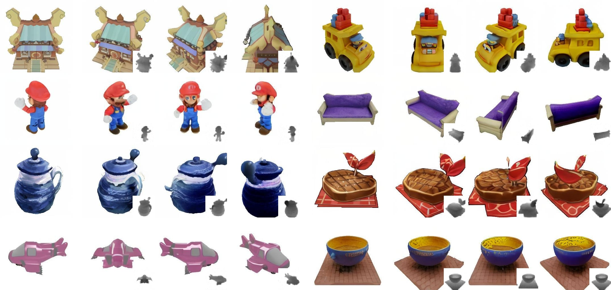

# MVD-Fusion

[**MVD-Fusion: Single-view 3D via Depth-consistent Multi-view Generation**](https://mvd-fusion.github.io/)<br/>
[Hanzhe Hu*](https://hzhupku.github.io/),
[Zhizhuo Zhou*](https://www.zhiz.dev/),
[Varun Jampani](https://varunjampani.github.io/),
[Shubham Tulsiani](https://shubhtuls.github.io/)<br/>
*Equal contribution<br/>
_CVPR 2024 | [GitHub](https://github.com/zhizdev/mvdfusion) | [arXiv]() | [Project page](https://mvd-fusion.github.io/)_


Given an input RGB image, **MVD-Fusion** generates multi-view RGB-D images using a depth-guided attention mechanism for enforcing multi-view consistency. We visualize the input RGB image (left) and three synthesized novel views (with generated depth in inset).


## Shoutouts and Credits
This project is built on top of open-source code. We thank the open-source research community and credit our use of parts of [Stable Diffusion](https://github.com/CompVis/stable-diffusion), [kiuikit](), [Zero-1-to-3](), and [Syncdreamer]().


## Code
Our code release contains:

1. Code for inference
2. Code for training
3. Pretrained weights on Objaverse

For bugs and issues, please open an issue on GitHub and I will try to address it promptly.


## Environment Setup
Please follow the environment setup guide in [ENVIRONMENT.md](ENVIRONMENT.md).

## Dataset
We provide two evaluation dataset, Google Scanned Objects (GSO) and SyncDreamer in-the-wild dataset. 

1. (optional) Download GSO evaluation set [here]() and extract it to `demo_datasets/gso_eval`.
2. (optoinal) Download in-the-wild evaluation set [here]() and extract it to `demo_datasets/syncdreamer_wild`.

## Pretrained Weights
MVD-Fusion requires Zero-1-to-3 weights, CLIP ViT weights, and finetuned MVD-Fusion weights. 
1. Find SparseFusion weights [here](https://drive.google.com/drive/folders/1Czsnf-PVjwH-HL7K5mTt_kF9u-PVWRyL?usp=share_link). Please download and put in `checkpoints/sf/{category_name}`. 
2. Download Stable Diffusion v-1-3 weights [here](https://huggingface.co/CompVis/stable-diffusion-v-1-3-original) and rename `sd-v1-3.ckpt` to `sd-v1-3-vae.ckpt`. While our code is compatible with the default downloaded weight, we only use the VAE weights from Stable Diffusion. We assume the default location and filename of the vae checkpoint to be `checkpoints/sd/sd-v1-3-vae.ckpt`. 

## Evaluation


### Examples
To run evaluation on the GSO test set, assuming the dataset and model weights are downloaded according to instructions above, run `demo.py`.


```shell
$ python demo.py -c configs/mvd_gso.yaml
```

### Flags
```
-g, --gpus              number of gpus to use (default: 1)
-p, --port              last digit of DDP port (default: 1)
-c, --config            yaml config file
```

### Output
Output artifact will be saved to `demo/` by default. 


## Training
Early access training code is provided in `train.py`. Please follow the evaluation tutorial above to setup the environment and pretrained  weights. It is recommended to directly modify `configs/mvd_train.yaml` to specify the experiment directory and set the training hyperparameters. We show training flags below. We recommend a minimum of 4 GPUs for training. 

```shell
$ python demo.py -c configs/mvd_train.yaml -g 4
```

### Flags
```
-g, --gpus              number of gpus to use (default: 1)
-p, --port              last digit of DDP port (default: 1)
-b, --backend           distributed data parallel backend (default: nccl)
```

### Using Custom Datasets
To train on a custom dataset, one needs to write a custom dataloader. We describe the required outputs for the `__getitem__` function, which should be a dictionary containing:
```
{
  'images': (B, 3, H, W) image tensor,
  'R': (B, 3, 3) PyTorch3D rotation,
  'T': (B, 3) PyTorch3D translation,
  'f': (B, 2) PyTorch3D focal_length in NDC space,
  'c': (B, 2) PyTorch3D principal_point in NDC space,
}
```


## Citation
If you find this work useful, a citation will be appreciated via:

```
@inproceedings{hu2024mvdfusion,
    title={MVD-Fusion: Single-view 3D via Depth-consistent Multi-view Generation}, 
    author={Hanzhe Hu and Zhizhuo Zhou and Varun Jampani and Shubham Tulsiani},
    booktitle={CVPR},
    year={2024}
}
```

## Acknowledgements 
We thank Bharath Raj, Jason Y. Zhang, Yufei (Judy) Ye, Yanbo Xu, and Zifan Shi for helpful discussions and feedback. This work is supported in part by NSF GRFP Grant No. (DGE1745016, DGE2140739).